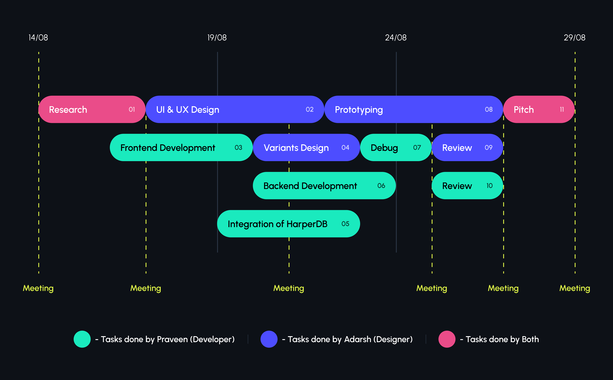

# Unlinked ( Developer Search )

_Solution to problem #2_

## Table of Contents

- [Table of Contents](#table-of-contents)
- [Pitch](#pitch)
- [Product Deno](#product-demo)
- [Prototype](#prototype-and-design)
- [Teamwork and Timeline](#teamwork-and-timeline)
- [Challenges](#challenges-faced)
- [Tech Stack](#tech-stack-used)

---

## Pitch 

 - Generally, Looking for cadidates or developers is a very boring process it is no fun at all.  
So what problem unlinked solves is to make hiring process **fun and easier** on a **clutter free interface** with the **important information** that a hiring manager actually need to get the candidate **worth for an interview** without wasting so much time.  

- Firstly it collects all the information from hiring manager. 

- Then it provides a clear and clutter free interface to filter out the the candidates by pinning them or swipe to next candidate which can be worth for the interview.

- Pinned Profiles will be saved and you can come later and see list of candidates which you preffered for interview.

---

## Product Demo

[Youtube Link](https://youtu.be/hIwforbaGcM)

---

## Prototype and Design

- [Prototype Link](https://www.figma.com/proto/cWy6EXvBNzKocgEG3kVL50/Unlinked?page-id=49%3A897&node-id=49%3A898&viewport=120%2C104%2C0.1&scaling=scale-down-width&starting-point-node-id=49%3A898&hide-ui=1)

- [WireFrame Link](https://www.figma.com/file/cWy6EXvBNzKocgEG3kVL50/Unlinked?node-id=49%3A897)

> Note: While viewing the prototype, try to use as it is a website. Try hovering and clicking over buttons, dropdowns and everything that seems interactive.

---

## Teamwork and Timeline

### Team Work

- **Research & Strategy** : Both of us worked on this part, we gave 3 dedicated days for proper research and strategy of how we are going to build this project.

- **Decision making & Conflict resolution** : Many times we had conflicts on design, user experience and many other things but we always discussed about the conflict and what are the various ways to solve it and always came to a conclusion which was best for the project.

- **Scheduled Meetings** : We had scheduled meetings to discuss about the progress and what we are going to do next.

### Timeline

---

## Challenges faced

### Choosing tech stack

**Solution** - Coming from Django Background , It was hard to decide if i should go with Django and its inbuilt ORM or choose harperDB and loosing all django ORM features.we tried many options to go with , but Next.js was one of the best way to put all things together.

### Everything else was easy !

---

## Tech Stack Used

### Next.js With Harper DB

#### Okay! but Why?

**Because we can use the API feature in Next.js without spinning up a separate node server with express and without wasting time in integrating with React.**

Also secure the HarperDB credentials using ENV variables. ( Which we didn't ).

> Anyways, Hackathon so far.

---

## Thank You!
